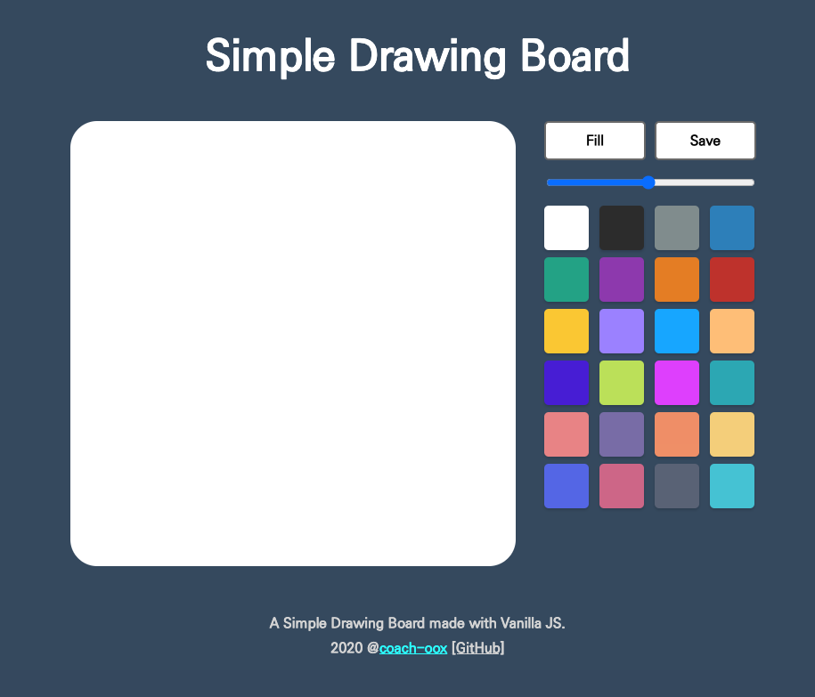

Vanilla (Pure) Javascript project for beginners.  
Check more projects [here](https://github.com/coachoox/vanilla-js-projects).

# Drawing Board

A simple web drawing board made with Vanilla JS.  
[[Demo]](https://coachoox.github.io/js-drawing-canvas/)  

## Preview

## Features

-   Drawing something (Line)
-   Fill canvas (Paint tool)
-   Save image to local
-   Change brush size
-   Change color

## Copyrights & Reference

-   Font : [KoPub Dotum](http://www.kopus.org/biz/electronic/font.aspx)
-   Colors : [Flat UI Colors](https://flatuicolors.com/)
-   `reset.css` : [meyerweb](https://meyerweb.com/eric/tools/css/reset/)
